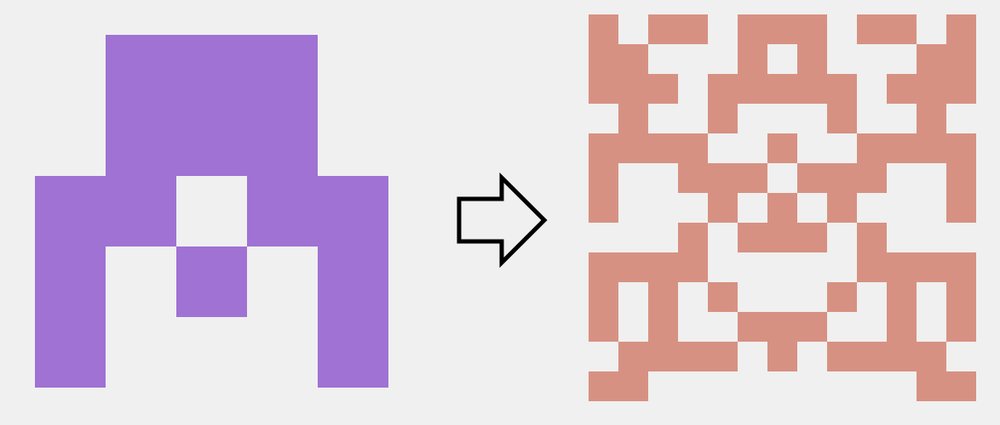

# Identicon

A Python port of a [Rust port](https://github.com/dgraham/identicon) of Github's [identicon](https://en.wikipedia.org/wiki/Identicon) algorithm with some parameters to customize.

 


## Usage

### Terminal
```
python identicon.py <STRING> [<FLAGS>]
```

### As an import
```
import identicon

identicon = identicon.Identicon(<ARGUMENTS>)
img = identicon.generate(<STRING>)

img.show()
img.save('identicon.png')
```

### Flags, arguments, and defaults
The name of the long flags are valid arguments when used as an import
```
--size,         -s = 500            # image size
--dim,          -d = 5              # N x N dimension of the sprite
                                    # 3 <= N <= 16
--hash             = md5            # [md5, sha256, sha512]
                                    # larger sprite dimensions will require larger hashes
--foreground    -f = None           # primary sprite color
--background    -b = (240,240,240)  # secondary sprite color

Terminal exclusive flags
--help          -h                  # display usage
--dont_show                         # do not display image
--save          <FILE.EXT>          # save image as
                                    # .jpg, .png
```


## Technical

### How the Rust port works
1. The string version of user id gets hashed with MD5. The digest is 128 bits (16 bytes).

    Assume the digest to be in the form `A B C D E F G H I J K L M N O P` where each letter represents a byte.

2. The first 7.5 bytes of the digest are used to calculate whether or not a pixel should be colored in the 5x5 identicon. Each byte is split in half to produce a [nibble, or half-byte](https://en.wikipedia.org/wiki/Nibble). Therefore, we are working with 15 nibbles for image generation.
    
    After splitting the bytes to nibbles, the nibbles used can be represented as `a1 a2 b1 b2 c1 c2 d1 d2 e1 e2 f1 f2 g1 g2 h1`. Notice `h2` is not used.

3. The parity (even/odd) of each nibble is used to determine if a pixel should be colored. If the parity is even, the pixel is colored; if the parity is odd, the pixel is uncolored.
    
    This is the way the nibbles are laid out:
    ```
             start
             v
    f1  c2  a1  c2'  f1'
    f2  d1  a2  d1'  f2'
    g1  d2  b1  d2'  g1'
    g2  e1  b2  e1'  g2'
    h1  e2  c1  e2'  h1'
    ^
    end
    ```
    The image is generated starting from the center going outward. Nibbles ranging from `c2'` to `h1'` are mirrors of the left side. The diagram above also shows why only 15 nibbles are used in image generation.

4. The pixel color is derived from the last 3.5 bytes of the digest.
    Using the same nibble expression as before, the last bytes are `m2 n1 n2 o1 o2 p1 p2`.

    - Hue is a 12 bit integer constructed from `m2 n1 n2`.
    - Sat is the 15th byte of the digest, `O`.
    - Lum is the 16th byte of the digest, `P`.

    Using these derived values, they are converted to RGB values. Refer to the [original hsl.rs](https://github.com/dgraham/identicon/blob/master/src/hsl.rs) file for more insight.

5. Overall, a total of 5 bytes from the hash are entirely unused, that being `h2 I J K L m1`.
    ```
        pixels       waste   color
    v             v         v     v
    A B C D E F G H I J K L M N O P
    ```

### What's different in this port
Take note of point #5 in the previous section. The original 5x5 algorithm essentially calls for 16 bytes which is the exact size of the MD5 digest. I originally wrote a generic function to allow the sprites to scale in dimension.
The number of bytes required can be expressed as `bytes = ceil(dim/2) * dim + 1`.

As dimensions increased, the number of bytes required from the hash also increased. However, as my generic function was based on the original, slightly-wasteful algorithm, the number of bytes wasted on larger dimensions would also increase.

In the interest of maximizing sprite dimensions for the available hashes, I've decided to optimize data usage for any size other than the original (for the sake of authenticity).
```
Optimized

|<------- pixels -------->|
|                   |color|
v                   v     v
A B C D E F G H I J K L M N O P ...
```

The new byte requirement is `bytes = [ceil(dim/2) * dim] / 2`. We divide by 2 because each pixel realistically needs half a byte to generate.

The unoptimized 5x5 requires 16 bytes, whereas an optimized 6x6 needs 9 bytes. Even an optimized 7x7 only requires 14 bytes.